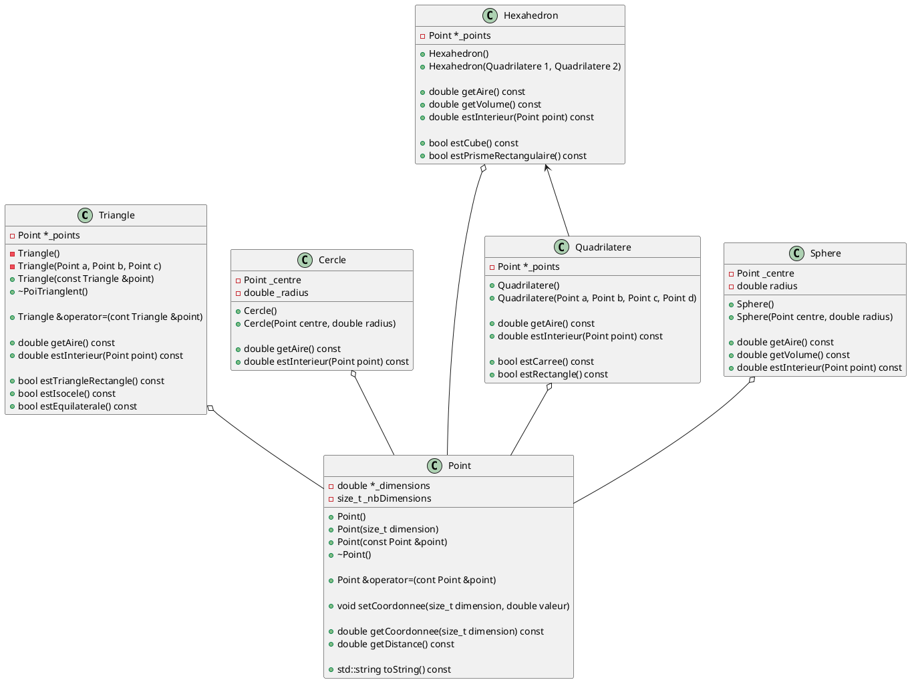

# Test

This is a Markdown file. 2

$$
e^{i\pi} + 1 = 0
$$

```plantuml
@startuml

Triangle o-- Point
Cercle o-- Point
Quadrilatere o-- Point
Sphere o-- Point
Hexahedron o-- Point
Hexahedron <-- Quadrilatere

class Point {
    - double *_dimensions
    - size_t _nbDimensions

    + Point()
    + Point(size_t dimension)
    + Point(const Point &point)
    + ~Point()

    + Point &operator=(cont Point &point)

    + void setCoordonnee(size_t dimension, double valeur)

    + double getCoordonnee(size_t dimension) const
    + double getDistance() const

    + std::string toString() const
}

class Triangle {
    - Point *_points
    
    - Triangle()
    - Triangle(Point a, Point b, Point c)
    + Triangle(const Triangle &point)
    + ~PoiTrianglent()

    + Triangle &operator=(cont Triangle &point)

    + double getAire() const
    + double estInterieur(Point point) const

    + bool estTriangleRectangle() const
    + bool estIsocele() const
    + bool estEquilaterale() const
}

class Cercle {
    - Point _centre
    - double _radius

    + Cercle()
    + Cercle(Point centre, double radius)

    + double getAire() const
    + double estInterieur(Point point) const
}

class Quadrilatere {
    - Point *_points
    
    + Quadrilatere()
    + Quadrilatere(Point a, Point b, Point c, Point d)

    + double getAire() const
    + double estInterieur(Point point) const

    + bool estCarree() const
    + bool estRectangle() const
}

class Sphere {
    - Point _centre
    - double radius

    + Sphere()
    + Sphere(Point centre, double radius)

    + double getAire() const
    + double getVolume() const
    + double estInterieur(Point point) const
}

class Hexahedron {
    - Point *_points
    
    + Hexahedron()
    + Hexahedron(Quadrilatere 1, Quadrilatere 2)

    + double getAire() const
    + double getVolume() const
    + double estInterieur(Point point) const

    + bool estCube() const
    + bool estPrismeRectangulaire() const
}

@enduml
```