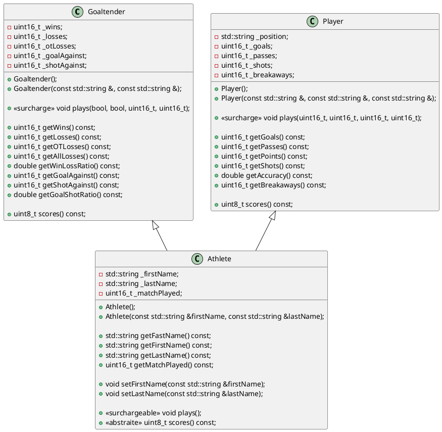

# Laboratoire 05-B

## Objectif

On poursuit notre quête d'héritage et de polymophisme en ajoutant les concepts de surcharge de méthode et de méthode abstraite. 6

6

## Parlons Hockey

Nous avons des athlètes professionnels jouant au hockey. Ces athlètes peuvent être soit un joueur ou un gardien de but. Chaque athlète joue des parties, a un nom et un prénom, et obtient un *scores* qui représente son importance dans le jeu.

Pour un gardien, le score se calcule suivant l'équation suivante, où $W$ est le nombre de victoire, $L$ est le nombre de défaites, $O_t$ et le nombre de défaites en prolongation, $S_a$ est le nombre de tirs reçus, $G_a$ est le nombre de buts accordés.

$$
S_g = (W - L) \times 5 + O_t + \frac{(S_a - G_a)}{10}
$$

Pour un joueur, considérant que $G$ est le nombre de buts, $A$ est le nombre de passes, $S$ le nombre de tir et $B$ le nombre d'échappées:

$$
S_p = G \times 2 + A + B + \frac{S}{10}
$$

Voici un diagramme de classes représentant notre application:



La méthode `plays` sans paramètre, définie dans la classe `Athlete`, doit incrémenter le nombre de parties jouées par l'athlète, tandis que les méthodes `plays` définies dans les classes filles doivent mettre à jour les autres attributs en fonction des paramètres reçus **en plus d'appeler la méthode parente**.

Vous devez implémenter votre solution de manière à pouvoir exécuter le code suivant avec succès (à mettre dans votre `main`). N'oubliez pas de mettre les bons *include* et de définir les méthodes ou les fonctions manquantes.


```cpp
int main () {
    Goaltender price("Carey", "Price");
    price.plays(true, false, 1, 26);
    price.plays(true, false, 0, 22);
    price.plays(true, true, 2, 19);
    price.plays(false, false, 4, 25);
    price.plays(true, false, 0, 27);
    price.plays(true, false, 3, 26);
    price.plays(false, true, 3, 41);
    price.plays(true, false, 1, 16);
    price.plays(true, false, 2, 31);
    price.plays(true, false, 4, 32);


    std::cout << std::setw(24) << "Nom"
    << std::setw(8) << std::right << "Partie"
    << std::setw(8) << std::right << "Vict."
    << std::setw(8) << std::right << "Déf."
    << std::setw(8) << std::right << "Pro."
    << std::setw(8) << std::right << "V/P"
    << std::setw(8) << std::right << "BC"
    << std::setw(8) << std::right << "TC"
    << std::setw(8) << std::right << "B/T"
    << std::setw(8) << std::right << "Scores" << std::endl;
    std::cout << price << std::endl;


    Player crosby("Center", "Sydney", "Crosby");
    crosby.plays(1, 0, 6, 1);
    crosby.plays(0, 3, 4, 0);
    crosby.plays(1, 1, 3, 0);
    crosby.plays(0, 1, 7, 0);
    crosby.plays(0, 0, 4, 2);
    crosby.plays(3, 0, 8, 0);
    crosby.plays(0, 0, 1, 0);
    crosby.plays(0, 2, 2, 0);
    crosby.plays(1, 1, 4, 0);
    crosby.plays(0, 0, 1, 0);
    std::cout << std::setw(24) << "Nom"
    << std::setw(8) << std::right << "Partie"
    << std::setw(8) << std::right << "But"
    << std::setw(8) << std::right << "Passe"
    << std::setw(8) << std::right << "Pts"
    << std::setw(8) << std::right << "Tir"
    << std::setw(8) << std::right << "Pré."
    << std::setw(8) << std::right << "Échap."
    << std::setw(8) << std::right << "Scores" << std::endl;
    std::cout << crosby << std::endl;

    return 0;
}
```

La sortie devrait ressembler à ceci:

```
                     Nom  Parties   Vict.   Déf.    Pro.     V/P      BC      TC     B/T  Scores
             Carey Price      10       8       1       1   0.800      20     265   0.925      60
                     Nom  Partie     But   Passe     Pts     Tir   Pré. Échap.  Scores
           Sydney Crosby      10       6       8      14      40   0.150       3      27
```
